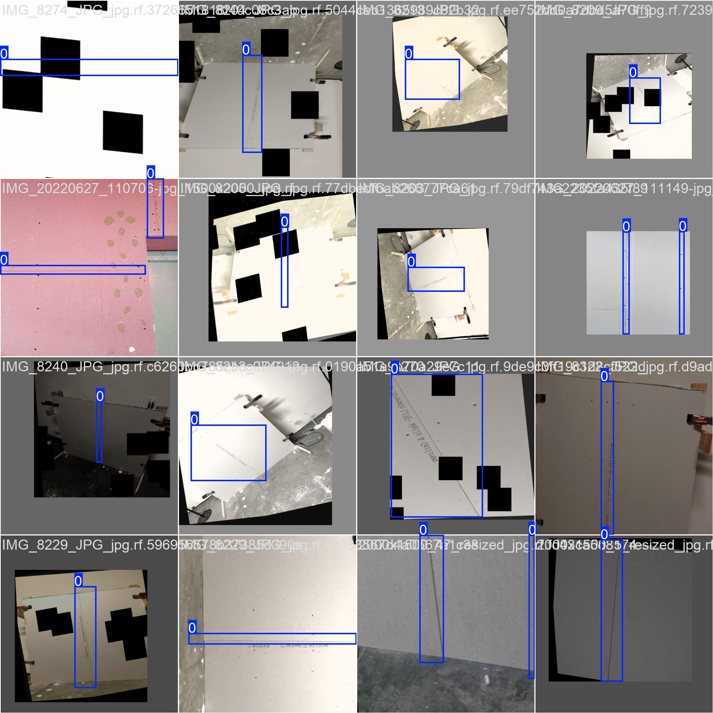
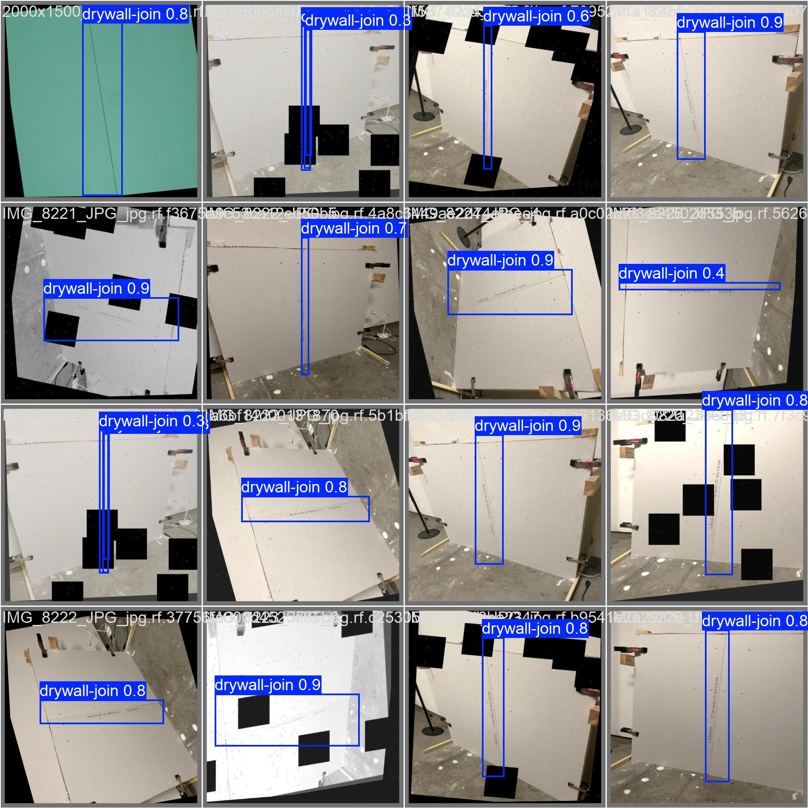

# Drywall Joint Detection - YOLOv8 Training Report

## Overview
Trained a **bounding-box object detection model** to detect drywall joints/taping areas in construction images. The dataset contained only bounding-box annotations (no segmentation masks), so we used YOLOv8 Nano for object detection.

## Model
**YOLOv8n** (Ultralytics)
- Parameters: 3,011,043
- Task: Object Detection
- Classes: 1 (`drywall-join`)

## Dataset
**Drywall-Join-Detect** (Roboflow)
- Source: https://universe.roboflow.com/objectdetect-pu6rn/drywall-join-detect
- Train: 1,877 images
- Validation: 202 images
- Annotation format: Bounding boxes (YOLO format)
- Single class: drywall joints/taping areas

### Training Configuration
```
Optimizer: AdamW (lr=0.002)
Batch size: 16
Image size: 640×640
Epochs: 50
Training time: ~4.5 hours
```

## Results

### Training Metrics

| Epoch | Box Loss (train) | Cls Loss (train) | Precision (val) | Recall (val) | mAP@0.5 (val) | mAP@0.5-0.95 (val) |
|-------|------------------|------------------|-----------------|--------------|---------------|-------------------|
| 1     | 1.949           | 2.602           | 33.2%          | 44.3%       | 37.0%        | 16.5%            |
| 10    | 1.534           | 1.384           | 73.7%          | 43.4%       | 46.1%        | 28.3%            |
| 20    | 1.344           | 1.120           | 88.1%          | 87.0%       | 88.7%        | 56.8%            |
| 30    | 1.229           | 0.983           | 89.7%          | 85.7%       | 89.3%        | 60.5%            |
| 40    | 1.128           | 0.882           | 92.4%          | 87.6%       | 91.3%        | 66.1%            |
| **50**| **0.858**       | **0.572**       | **93.9%**      | **91.3%**   | **92.4%**    | **71.4%**        |

### Validation Metrics (Final Epoch)

| Metric | Value |
|--------|-------|
| Box Loss | 0.849 |
| Class Loss | 0.530 |
| DFL Loss | 0.976 |
| **Precision** | **93.9%** |
| **Recall** | **91.3%** |
| **mAP@0.5** | **92.4%** |
| **mAP@0.5-0.95** | **71.4%** |

**Note**: IoU metrics computed via custom greedy matching callback during training showed stable convergence (~0.805 at epoch 44).

## Model Performance

**Key Results**:
- Strong detection accuracy (92.4% mAP@0.5)
- High precision (93.9%) - minimal false positives
- Good recall (91.3%) - catches most drywall joints
- Excellent localization (71.4% mAP@0.5-0.95)
- Smooth convergence with no overfitting
- Stable IoU metrics (~0.805) throughout training

## Runtime & Footprint

| Metric | Value |
|--------|-------|
| Training time | 4.5 hours (50 epochs) |
| Time per epoch | ~5.4 minutes |
| Model size | 6.0 MB (`best.pt`) |
| Inference speed | ~2.7s per batch (16 images) |

## Visual Results

### Training Samples
Sample training batch showing ground truth bounding boxes:



### Validation Predictions
Model predictions on validation set:



## Conclusion

Successfully trained a YOLOv8 Nano object detection model for drywall joint detection with **92.4% mAP@0.5** and **93.9% precision**. The model demonstrates strong performance in localizing drywall joints and taping areas in construction images.

---
